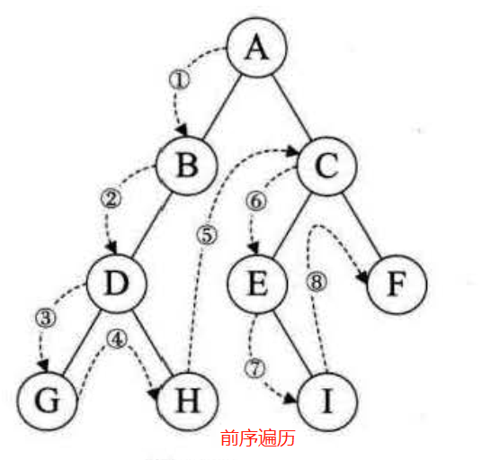
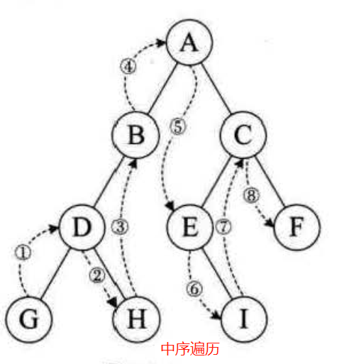
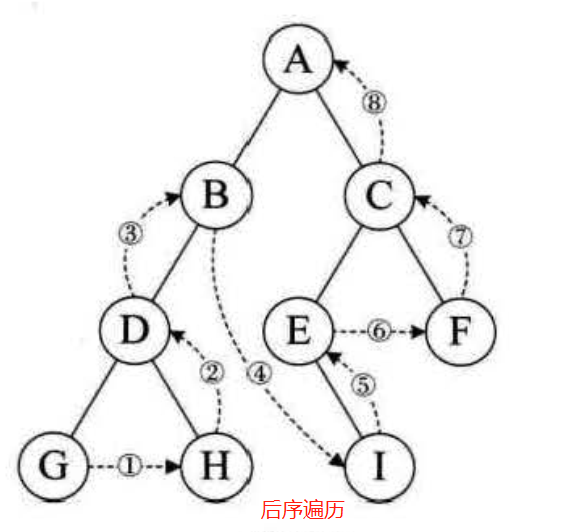

<!--
 * @Author: Bean.Ding
 * @Date: 2020-06-16 15:11:13
 * @LastEditTime: 2020-06-16 15:11:26
 * @LastEditors: Bean.Ding
--> 
## 二叉树知识点

$注意事项：$

$1.以根访问顺序决定是什么遍历$

$2.左子树都是优先右子树$

- 前序遍历：先访问根节点，再遍历左子树，再遍历右子树

    

    

    - 递归遍历

    - ```javascript
        
        ```

    - 非递归遍历

    - ```javascript
        
        ```

    - 

- 中序遍历：先遍历左子树，再访问根节点，再遍历右子树

    

    - 递归遍历

    - ```javascript
        
        ```

    - 非递归遍历

    - ```javascript
        
        ```

    - 

- 后序遍历：先遍历左子树，再遍历右子树，再访问根节点

    

    - 递归遍历

    - ```javascript
        
        ```

    - 非递归遍历

    - ```javascript
        
        ```

    - 

- DFS 深度搜索-从上到下

    - ```javascript
        
        ```

    - 

- DFS 深度搜索-从下向上（分治法）

    - ```javascript
        
        ```

    - 

- BFS 层次遍历

    - ```javascript
        
        ```

    - 

    - 